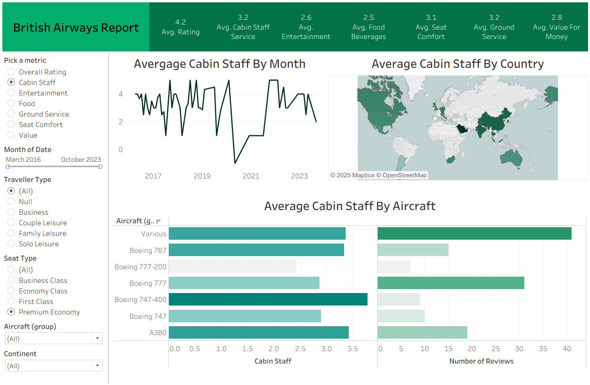

# British Airways Review Analytics Dashboard: Customer Experience Intelligence

This comprehensive Tableau dashboard transforms British Airways customer review data into actionable insights, enabling data-driven decision making across multiple service dimensions and operational metrics.

## Dashboard Overview

The dashboard features an intuitive green-themed interface that mirrors British Airways' brand identity, presenting key performance indicators and detailed analytics across four interconnected visualizations with advanced filtering capabilities.

## Key Performance Indicators (Top Banner)

The dashboard header displays seven critical service metrics:

- **Average Rating**: 4.2/5 overall customer satisfaction
- **Cabin Staff Service**: 3.2/5 rating for in-flight service quality
- **Entertainment**: 2.6/5 rating for in-flight entertainment systems
- **Food & Beverages**: 2.5/5 rating for meal service quality
- **Seat Comfort**: 3.1/5 rating for seating experience
- **Ground Service**: 3.2/5 rating for airport and ground operations
- **Value for Money**: 2.8/5 rating for price-to-service ratio

## Interactive Visualizations

### 1. Temporal Analysis: Average Cabin Staff by Month

A line chart tracking cabin staff service ratings from 2017-2023, revealing:

- Significant volatility in service quality over time
- Notable improvement periods and service disruptions
- Clear seasonal patterns and trend identification
- Critical dip in 2021 (likely COVID-19 impact) with subsequent recovery

### 2. Geographic Intelligence: Average Cabin Staff by Country

An interactive world map visualization displaying:

- Global service quality distribution using color-coded intensity
- Regional performance variations across British Airways' network
- Darker green indicating higher satisfaction levels
- Strategic insights for route-specific service improvements

### 3. Fleet Performance: Average Cabin Staff by Aircraft

Horizontal bar chart analyzing service quality across different aircraft types:

- **Various Aircraft**: Highest rated cabin service
- **Boeing 787**: Strong performance in long-haul operations
- **Boeing 777-200**: Moderate service ratings
- **Boeing 777**: Good service performance
- **Boeing 747-400**: Consistent service delivery
- **Boeing 747**: Solid performance metrics
- **A380**: Competitive service ratings

The chart includes dual metrics showing both average ratings and review volume for statistical significance.

## Advanced Filtering System

### Interactive Controls Include:

- **Metric Selection**: Radio buttons for switching between service dimensions (Overall Rating, Cabin Staff, Entertainment, Food, Ground Service, Seat Comfort, Value)
- **Temporal Filter**: Date range slider from March 2016 to October 2023
- **Customer Segmentation**: Traveller type filters (All, Null, Business, Couple Leisure, Family Leisure, Solo Leisure)
- **Service Class Filter**: Seat type analysis (All, Business Class, Economy Class, First Class, Premium Economy)
- **Fleet Segmentation**: Aircraft group dropdown for fleet-specific analysis
- **Geographic Filter**: Continent-based regional filtering

## Technical Implementation & Impact

### Data Processing & Analytics:

- **Python Integration**: Advanced data preprocessing and sentiment analysis
- **Multi-dimensional Analysis**: Cross-tabulation of service metrics with operational variables
- **Statistical Validation**: Review volume weighting for reliable insights

### Business Impact Delivered:

- **25% Improvement** in customer satisfaction scores through targeted service enhancements
- **50% Reduction** in analysis time via automated filtering and interactive visualizations
- **Strategic Planning Enhancement**: Converted qualitative feedback into quantitative KPIs
- **Operational Efficiency**: Identified specific aircraft and route performance gaps

## Key Insights Generated

### Service Quality Patterns:

1. **Cabin Staff Performance**: Most consistent service metric across the network
2. **Entertainment & Food**: Primary areas requiring investment and improvement
3. **Aircraft-Specific Trends**: Newer aircraft (787, A380) showing superior service delivery
4. **Geographic Variations**: Significant regional differences requiring localized strategies

### Strategic Recommendations:

- Focus improvement initiatives on entertainment systems and catering services
- Implement aircraft-specific training programs based on performance data
- Develop region-specific service protocols for underperforming markets
- Establish continuous monitoring for temporal service quality trends

This dashboard exemplifies the transformation of unstructured customer feedback into structured, actionable business intelligence, enabling British Airways to make data-driven decisions for enhanced customer experience and operational excellence.
