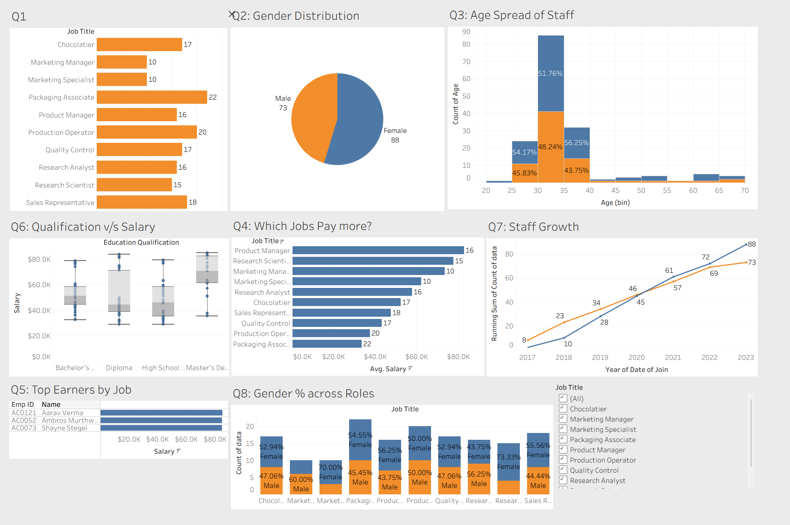

# HR Analytics Dashboard: Comprehensive Workforce Analysis

You can find this dashboard at Tableau Public: https://public.tableau.com/app/profile/kiran.sathya.sunkoji.rao/viz/HRDashboard_17576575138550/Q10

This interactive Tableau dashboard provides a complete overview of organizational workforce data through eight interconnected visualizations, designed to support strategic HR decision-making and workforce planning.

## Dashboard Components

### Q1: Staff Distribution by Role

A horizontal bar chart displaying headcount across all job functions, from Chocolatier (17 staff) to Packaging Associate (22 staff), providing clear visibility into organizational structure and resource allocation.

### Q2: Gender Distribution

An interactive pie chart showing the overall gender balance (Female 58%, Male 73%), with dynamic filtering capabilities that allow users to drill down by specific job titles to analyze gender representation across different roles.

### Q3: Age Demographics

A detailed histogram with customized age bins revealing workforce age distribution, showing concentration in the 30-40 age range (45.83% and 43.75% respectively), essential for succession planning and retirement forecasting.

### Q4: Compensation Analysis

A horizontal bar chart ranking average salaries by position, highlighting that Product Managers command the highest compensation, followed by Research Scientists and Marketing Managers, supporting salary benchmarking initiatives.

### Q5: Top Performers

Individual salary analysis featuring the three highest earners (Aarav Verma, Ambros Murthwaite, and Shayne Stegel) with precise compensation data, enabling talent retention strategies for key personnel.

### Q6: Education vs. Compensation

Box plot analysis correlating educational qualifications with salary ranges, revealing compensation patterns across Bachelor's, Diploma, High School, and Master's degree holders.

### Q7: Growth Trajectory

Time series analysis tracking total headcount growth from 2017 to 2023, with running totals showing steady organizational expansion from 8 to 88 employees, including job-specific growth patterns.

### Q8: Role-Based Gender Analysis

Stacked percentage bars showing male/female distribution within each job function, revealing significant gender variations across departments (from 47.06% male Chocolatiers to 70% male Marketing Specialists).

## Key Interactive Features

- **Dynamic Filtering**: Job title filters that update multiple visualizations simultaneously
- **Contextual Analysis**: Advanced filtering preventing data conflicts across related charts
- **Custom Calculations**: Implemented measures for complex analysis including leave balance tracking (identifying staff with >20 days accrued)
- **Dashboard Actions**: Seamless navigation and cross-filtering between visualizations
- **Professional Formatting**: Custom color schemes, tooltips, and text boxes for enhanced readability

## Technical Implementation

The dashboard incorporates advanced Tableau functionality including:

- Custom bin creation for age demographics
- Quick table calculations for running totals
- Calculated fields for employee filtering by starting letter
- Context filters to resolve top filter conflicts
- Interactive dashboard actions for seamless user experience

## Business Value

This dashboard transforms raw HR data into actionable insights, supporting:

- **Workforce Planning**: Understanding current staff distribution and growth patterns
- **Compensation Strategy**: Data-driven salary benchmarking and equity analysis
- **Diversity Initiatives**: Gender representation tracking across all organizational levels
- **Talent Management**: Identification of top performers and retention strategies
- **Strategic Decision Making**: Comprehensive organizational analytics for leadership

The intuitive, interactive interface enables HR professionals and leadership to quickly identify trends, make informed decisions, and drive organizational success through data-driven workforce management.
