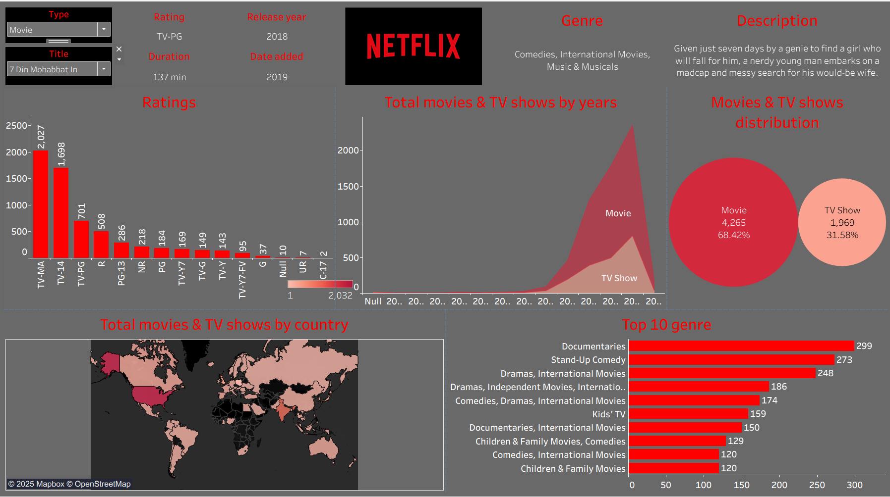

# Netflix Analytics Dashboard

You can find this dashboard at Tableau Public: https://public.tableau.com/app/profile/kiran.sathya.sunkoji.rao/viz/Netflix_17581118474300/Netflix?publish=yes

## Overview

A comprehensive data visualization dashboard providing insights into Netflix's content library, distribution patterns, and performance metrics. This dashboard enables stakeholders to analyze content trends, geographic distribution, and genre performance to support strategic decision-making.

## Key Features

### Content Filtering & Search

- **Type Filter**: Toggle between Movies and TV Shows
- **Title Search**: Quick search functionality to find specific content
- **Interactive Selection**: Click-to-filter capabilities across all visualizations

### Performance Analytics

- **Ratings Distribution**: Comprehensive breakdown of content ratings (TV-MA, TV-14, PG-13, etc.) showing content maturity levels
- **Genre Analysis**: Top 10 genre performance with detailed count metrics
- **Temporal Trends**: Year-over-year content addition patterns

### Geographic Intelligence

- **Global Content Map**: Interactive world map showing content distribution by country
- **Regional Insights**: Visual representation of Netflix's content sourcing and availability patterns

## Dashboard Components

### 1. Content Information Panel

- Movie/TV Show type selector
- Title dropdown with search capability
- Detailed metadata display (rating, release year, duration, genre, description)

### 2. Ratings Analysis Chart

- Bar chart visualization of content distribution across rating categories
- Helps understand content maturity and target audience alignment

### 3. Content Timeline Visualization

- Area chart showing movies vs TV shows added over time
- Identifies content acquisition trends and strategic shifts

### 4. Distribution Analysis

- Pie chart comparing total movies vs TV shows in the catalog
- Provides high-level content portfolio overview

### 5. Geographic Distribution Map

- Color-coded world map indicating content density by country
- Supports international expansion and localization strategies

### 6. Genre Performance Dashboard

- Horizontal bar chart of top 10 genres by content count
- Enables genre strategy optimization and content gap analysis

## Business Value

### Strategic Decision Support

- **Content Strategy**: Identify successful genres and content types for future investments
- **Market Expansion**: Understand geographic content distribution for regional strategy planning
- **Audience Targeting**: Analyze rating distributions to align content with target demographics

### Operational Insights

- **Content Portfolio Management**: Track the balance between movies and TV shows
- **Performance Monitoring**: Monitor content addition trends and seasonal patterns
- **Genre Optimization**: Identify over-represented or under-represented content categories

### Data-Driven Planning

- **Investment Decisions**: Support budget allocation based on genre and content type performance
- **International Strategy**: Guide market entry and localization efforts using geographic data
- **Content Acquisition**: Inform content licensing and production decisions

## Technical Specifications

- **Data Source**: Netflix content catalog
- **Visualization Engine**: Interactive dashboard with real-time filtering
- **Geographic Data**: Global country-level mapping with Mapbox integration
- **Last Updated**: 2019 (as indicated in the date added field)

This dashboard serves as a central hub for Netflix content analysis, enabling data-driven decisions across content strategy, market expansion, and audience engagement initiatives.
